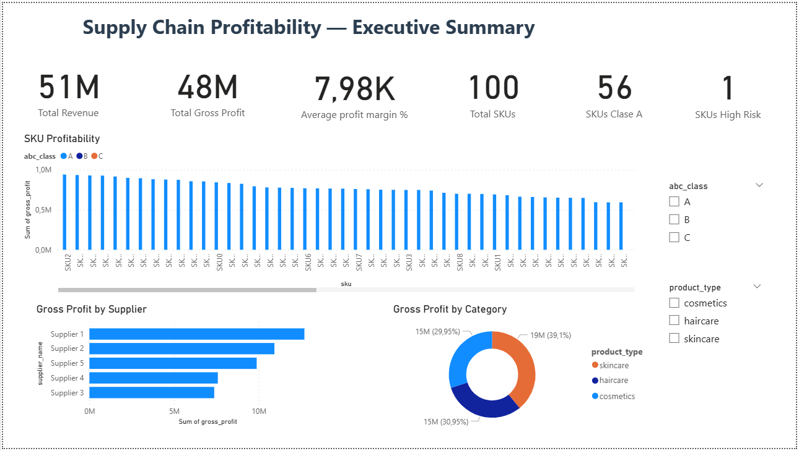
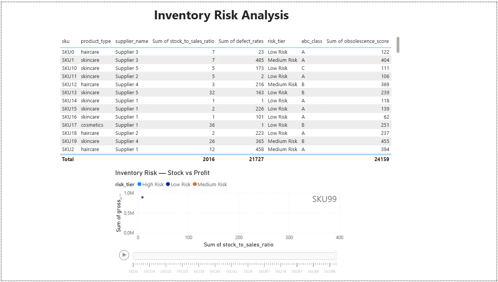
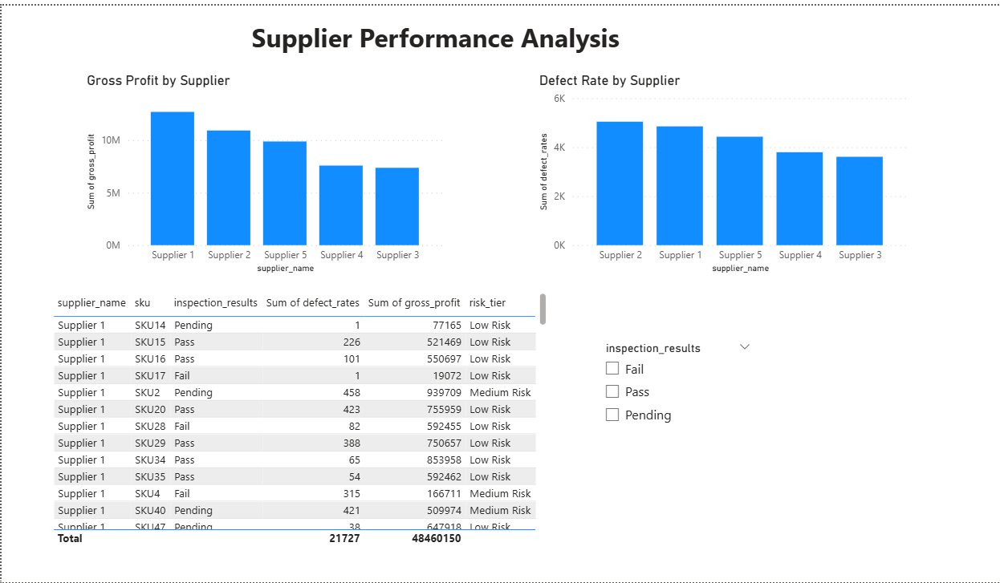

# 🏭 Supply Chain Profitability & Inventory Optimization

> Identifying the 20% of SKUs driving 80% of profit and reducing 
> obsolete inventory risk using SQL, Python and Power BI.

## 🎯 Business Problem
A supply chain operation needs to identify which products are truly 
profitable and which represent trapped capital in obsolete inventory.

## 🛠️ Tech Stack
- **PostgreSQL** — Data architecture and analytical queries
- **Python** — ABC classification, risk modeling and visualizations
- **Power BI** — Executive dashboard with 3 analytical pages

## 📁 Project Structure
- `data/` — Raw and processed datasets
- `sql/` — Schema, tables and analytical queries
- `python/` — EDA, ABC analysis, risk model and executive summary
- `outputs/charts/` — Generated visualizations
- `powerbi/` — Interactive executive dashboard

## 📊 Key Findings
- **Pareto confirmed:** 56% of SKUs drive 80% of gross profit
- **Category insight:** Skincare leads revenue but Cosmetics 
  has higher profit margins and lower defect rates
- **Supplier risk:** Supplier 1 generates most profit but has 
  highest defect exposure
- **Inventory health:** 64% Low Risk, 35% Medium Risk, 1% High Risk

## 💡 Business Recommendations
1. Prioritize weekly replenishment for Class A SKUs
2. Review Cosmetics pricing strategy — highest margin category
3. Negotiate quality SLAs with Supplier 1 and Supplier 2
4. Liquidate or discontinue Class C SKUs with High Risk score

## 🖼️ Dashboard Preview
### Executive Summary

### Inventory Risk Analysis

### Supplier Performance
